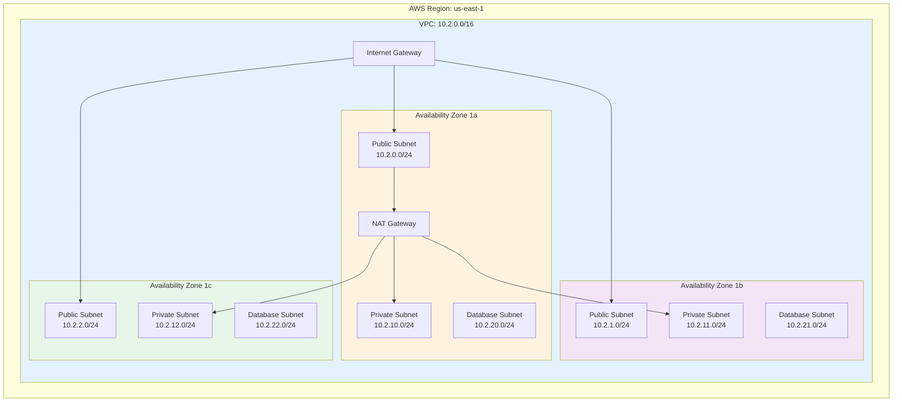
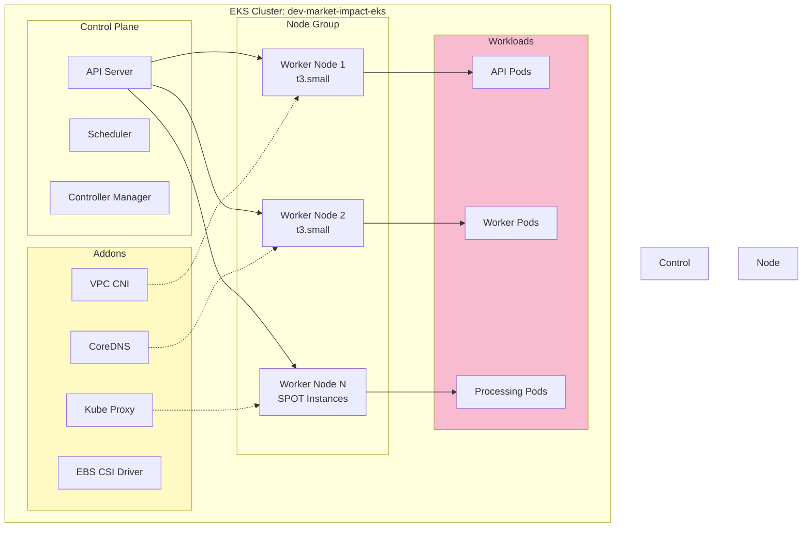
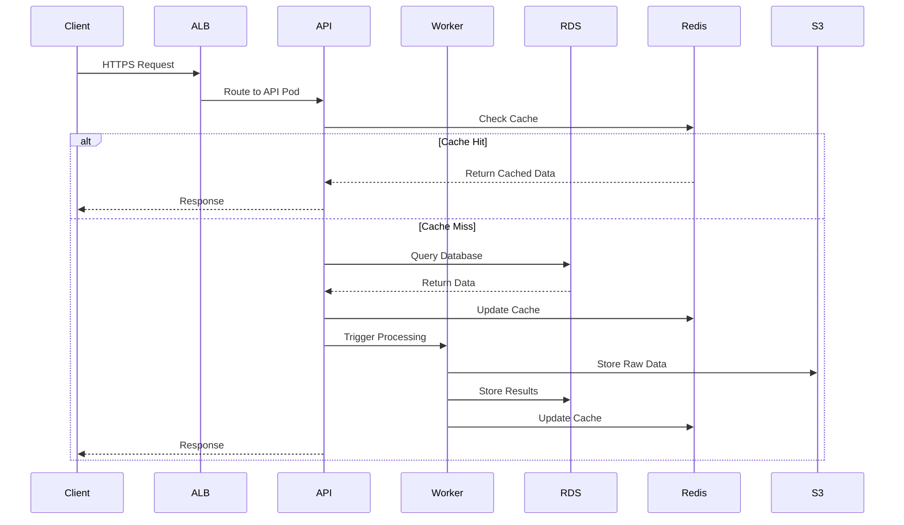
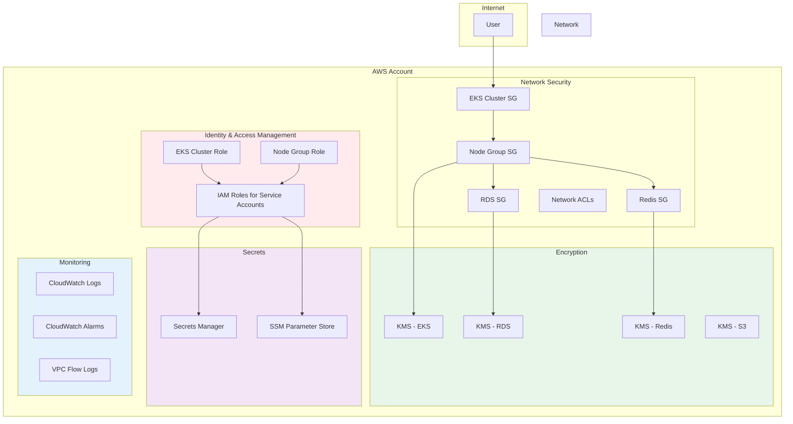
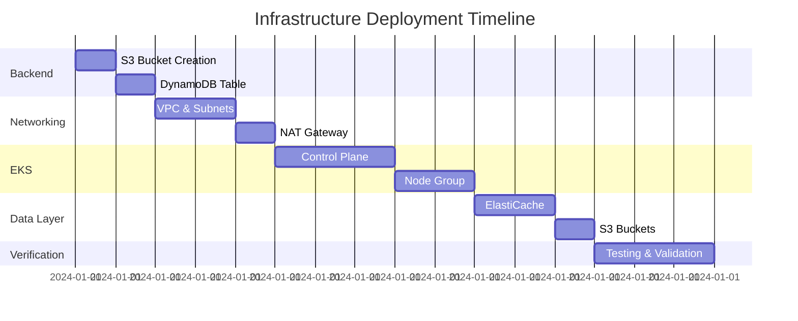
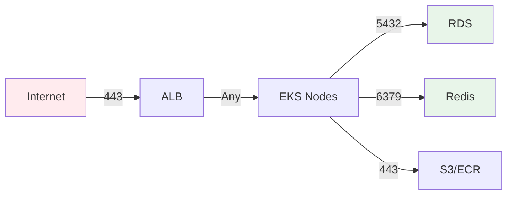
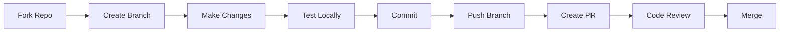

# 📊 Market Impact Analysis System - Terraform Infrastructure

<div align="center">


**Production-ready Terraform infrastructure for real-time financial news analysis and market impact assessment**

[Getting Started](#-quick-start) • [Architecture](#-architecture) • [Modules](#-modules) • [Deployment](#-deployment-guide) • [Contributing](#-contributing)

</div>

---

## 📑 Table of Contents

- [Overview](#-overview)
- [Architecture](#-architecture)
- [Prerequisites](#-prerequisites)
- [Quick Start](#-quick-start)
- [Project Structure](#-project-structure)
- [Modules](#-modules)
- [Environments](#-environments)
- [Deployment Guide](#-deployment-guide)
- [Configuration](#-configuration)
- [Security](#-security)
- [Monitoring](#-monitoring)
- [Cost Optimization](#-cost-optimization)
- [Troubleshooting](#-troubleshooting)
- [Best Practices](#-best-practices)
- [Contributing](#-contributing)

---

## 🎯 Overview

This repository contains the complete Infrastructure as Code (IaC) for the Market Impact Analysis System, a sophisticated platform designed to analyze financial news in real-time and assess its impact on market movements.

### Key Features

✅ **Multi-Environment Support** - Development, Staging, and Production configurations  
✅ **High Availability** - Multi-AZ deployment with automatic failover  
✅ **Auto-Scaling** - Kubernetes-based workload orchestration with EKS  
✅ **Security First** - Encryption at rest and in transit, private subnets, IAM roles  
✅ **Cost Optimized** - Intelligent resource sizing and lifecycle policies  
✅ **Monitoring Ready** - CloudWatch integration with custom alarms  
✅ **Disaster Recovery** - Automated backups and recovery procedures  

---

## 🏗️ Architecture

### High-Level Architecture

```mermaid
graph TB
    subgraph Internet
        Users[Users/Applications]
    end
    
    subgraph AWS Cloud
        subgraph VPC["VPC (10.2.0.0/16)"]
            subgraph Public Subnets
                IGW[Internet Gateway]
                NAT[NAT Gateway]
                ALB[Application Load Balancer]
            end
            
            subgraph Private Subnets
                subgraph EKS Cluster
                    API[API Services]
                    Worker[Worker Nodes]
                    Processing[Data Processing]
                end
            end
            
            subgraph Database Subnets
                RDS[(RDS PostgreSQL<br/>Existing Instance)]
                Redis[(ElastiCache Redis)]
            end
            
            subgraph Storage
                S3[S3 Data Lake]
            end
        end
        
        subgraph Security & Management
            KMS[AWS KMS]
            Secrets[Secrets Manager]
            CW[CloudWatch]
            SSM[Systems Manager]
        end
    end
    
    Users --> ALB
    ALB --> API
    API --> Worker
    Worker --> Processing
    Processing --> RDS
    Processing --> Redis
    Processing --> S3
    
    EKS Cluster --> KMS
    RDS --> KMS
    Redis --> KMS
    S3 --> KMS
    
    EKS Cluster --> CW
    RDS --> CW
    Redis --> CW
    
    API --> Secrets
    Worker --> Secrets

    style VPC fill:#e1f5ff
    style EKS Cluster fill:#fff4e6
    style Security & Management fill:#f3e5f5
    style Storage fill:#e8f5e9
```

### Network Architecture



### EKS Cluster Architecture



### Data Flow Architecture



### Security Architecture



---

## 📋 Prerequisites

Before you begin, ensure you have the following tools installed:

| Tool | Version | Purpose |
|------|---------|---------|
|  | ≥ 1.5.0 | Infrastructure provisioning |
|  | ≥ 2.x | AWS service interaction |
|  | ≥ 1.30 | Kubernetes management |
|  | Latest | Version control |

### AWS Requirements

- **AWS Account** with appropriate permissions
- **IAM User** or **Role** with the following policies:
  - `AmazonEC2FullAccess`
  - `AmazonEKSClusterPolicy`
  - `AmazonEKSWorkerNodePolicy`
  - `AmazonRDSFullAccess`
  - `AmazonElastiCacheFullAccess`
  - `AmazonS3FullAccess`
  - `IAMFullAccess`
  - `AWSKeyManagementServicePowerUser`

---

## 🚀 Quick Start

### 1. Clone the Repository

```bash
git clone https://github.com/your-org/market-impact-terraform.git
cd market-impact-terraform
```

### 2. Configure AWS Credentials

```bash
aws configure
# Enter your AWS Access Key ID
# Enter your AWS Secret Access Key
# Enter your default region: us-east-1
```

### 3. Initialize Terraform Backend (First Time Only)

```bash
cd environments/development
terraform init -backend-config=../../backend-configs/backenddev.tf
```

### 4. Review and Deploy

```bash
# Review the execution plan
terraform plan -var-file=../dev.tfvars

# Deploy infrastructure
terraform apply -var-file=../dev.tfvars
```

### 5. Configure kubectl

```bash
aws eks update-kubeconfig --region us-east-1 --name dev-market-impact-eks
kubectl get nodes
```

---

## 📁 Project Structure

```
terraform/
├── 📄 README.md                          # This file
├── 📄 .gitignore                         # Git ignore patterns
│
├── 📁 backend-configs/                   # Backend state configurations
│   ├── backenddev.tf                     # Development backend config
│   ├── backendstag.tf                    # Staging backend config
│   └── backendprod.tf                    # Production backend config
│
├── 📁 environments/                      # Environment-specific configurations
│   ├── 📄 dev.tfvars                     # Development variables
│   ├── 📄 staging.tfvars                 # Staging variables
│   ├── 📄 production.tfvars              # Production variables
│   │
│   └── 📁 development/                   # Development environment
│       ├── main.tf                       # Main configuration
│       ├── variables.tf                  # Variable definitions
│       └── outputs.tf                    # Output definitions
│
└── 📁 modules/                           # Reusable Terraform modules
    │
    ├── 📁 Networking/                    # VPC and networking
    │   ├── main.tf
    │   ├── variables.tf
    │   ├── outputs.tf
    │   └── README.md
    │
    ├── 📁 eks/                           # EKS cluster
    │   ├── main.tf
    │   ├── security-groups.tf
    │   ├── variables.tf
    │   ├── outputs.tf
    │   └── README.md
    │
    ├── 📁 rds/                           # RDS PostgreSQL
    │   ├── main.tf
    │   ├── variables.tf
    │   ├── outputs.tf
    │   └── README.md
    │
    ├── 📁 ElastiCache/                   # Redis cluster
    │   ├── main.tf
    │   ├── variables.tf
    │   ├── outputs.tf
    │   └── README.md
    │
    └── 📁 s3/                            # S3 buckets
        ├── main.tf
        ├── variables.tf
        ├── outputs.tf
        └── README.md
```

---

## 🧩 Modules

### 1. Networking Module

**Purpose:** Creates VPC, subnets, NAT gateways, and networking infrastructure.

**Resources:**
- ✅ VPC with DNS support
- ✅ Public subnets (3 AZs)
- ✅ Private subnets (3 AZs)
- ✅ Database subnets (3 AZs)
- ✅ Internet Gateway
- ✅ NAT Gateway (configurable single or multi-AZ)
- ✅ Route tables
- ✅ VPC Flow Logs (optional)
- ✅ VPC Endpoints (optional)

**Usage:**
```hcl
module "networking" {
  source = "../../modules/Networking"

  environment          = "dev"
  vpc_cidr             = "10.2.0.0/16"
  region               = "us-east-1"
  cluster_name         = "dev-market-impact-eks"
  enable_nat_gateway   = true
  single_nat_gateway   = true
  enable_flow_logs     = false
  enable_vpc_endpoints = false
}
```

### 2. EKS Module

**Purpose:** Provisions EKS cluster with managed node groups.

**Resources:**
- ✅ EKS Control Plane
- ✅ Managed Node Group with Auto Scaling
- ✅ IAM Roles and Policies
- ✅ Security Groups
- ✅ OIDC Provider for IRSA
- ✅ EKS Addons (VPC CNI, CoreDNS, Kube-proxy, EBS CSI)
- ✅ KMS encryption
- ✅ CloudWatch logging

**Features:**
- 🔹 SPOT instance support
- 🔹 Custom launch templates
- 🔹 IMDSv2 enforcement
- 🔹 EBS volume encryption
- 🔹 Node monitoring

**Usage:**
```hcl
module "eks" {
  source = "../../modules/eks"

  cluster_name       = "dev-market-impact-eks"
  cluster_version    = "1.30"
  environment        = "dev"
  vpc_id             = module.networking.vpc_id
  private_subnet_ids = module.networking.private_subnet_ids
  public_subnet_ids  = module.networking.public_subnet_ids
  
  node_instance_types = ["t3.small"]
  node_desired_size   = 15
  node_min_size       = 15
  node_max_size       = 17
  node_capacity_type  = "SPOT"
}
```

### 3. RDS Module

**Purpose:** Creates PostgreSQL RDS instance with high availability.

**Resources:**
- ✅ RDS PostgreSQL instance
- ✅ DB subnet group
- ✅ Parameter group
- ✅ Security group
- ✅ KMS encryption
- ✅ Automated backups
- ✅ Secrets Manager integration
- ✅ CloudWatch alarms

**Features:**
- 🔹 Multi-AZ deployment
- 🔹 Performance Insights
- 🔹 Enhanced Monitoring
- 🔹 Automated backups
- 🔹 Point-in-time recovery

**Note:** In the development environment, we use an existing RDS instance created outside Terraform.

### 4. ElastiCache Module

**Purpose:** Provisions Redis cluster for caching.

**Resources:**
- ✅ Redis Replication Group
- ✅ Subnet group
- ✅ Parameter group
- ✅ Security group
- ✅ KMS encryption
- ✅ Secrets Manager integration
- ✅ CloudWatch alarms

**Features:**
- 🔹 Automatic failover
- 🔹 Multi-AZ support
- 🔹 Redis 7.1 with latest features
- 🔹 Automated snapshots
- 🔹 Transit encryption support

**Usage:**
```hcl
module "elasticache" {
  source = "../../modules/ElastiCache"

  environment             = "dev"
  vpc_id                  = module.networking.vpc_id
  private_subnet_ids      = module.networking.private_subnet_ids
  allowed_security_groups = [module.eks.node_security_group_id]
  
  redis_version              = "7.1"
  redis_node_type            = "cache.t3.micro"
  redis_num_cache_nodes      = 1
  multi_az_enabled           = false
  transit_encryption_enabled = false
}
```

### 5. S3 Module

**Purpose:** Creates S3 buckets for data storage.

**Resources:**
- ✅ S3 bucket
- ✅ Bucket policy
- ✅ Versioning
- ✅ Server-side encryption (KMS)
- ✅ Lifecycle policies
- ✅ Public access block
- ✅ CloudWatch size monitoring

**Features:**
- 🔹 Intelligent tiering
- 🔹 Lifecycle transitions
- 🔹 CORS configuration
- 🔹 Event notifications
- 🔹 Access logging

**Usage:**
```hcl
module "s3_data_lake" {
  source = "../../modules/s3"

  environment    = "dev"
  bucket_name    = "dev-market-impact-data-lake-${account_id}"
  bucket_purpose = "data-lake"
  
  versioning_enabled      = false
  lifecycle_rules_enabled = true
  logging_enabled         = false
  
  eks_node_role_arn = module.eks.node_role_arn
}
```

---

## 🌍 Environments

### Development Environment

**Purpose:** Testing and development
**Cost:** ~$150-200/month
**Configuration:** `environments/dev.tfvars`

| Resource | Configuration |
|----------|---------------|
| VPC CIDR | `10.2.0.0/16` |
| EKS Nodes | 15-17 x t3.small (SPOT) |
| RDS | Existing instance (manually created) |
| Redis | 1 x cache.t3.micro |
| NAT | Single NAT Gateway |
| High Availability | No |

### Staging Environment

**Purpose:** Pre-production testing
**Cost:** ~$300-400/month
**Configuration:** `environments/staging.tfvars`

| Resource | Configuration |
|----------|---------------|
| VPC CIDR | `10.1.0.0/16` |
| EKS Nodes | 1-5 x t3.medium |
| RDS | db.t3.small, Single-AZ |
| Redis | 1 x cache.t3.small |
| NAT | Single NAT Gateway |
| High Availability | Partial |

### Production Environment

**Purpose:** Live production workloads
**Cost:** ~$800-1200/month
**Configuration:** `environments/production.tfvars`

| Resource | Configuration |
|----------|---------------|
| VPC CIDR | `10.0.0.0/16` |
| EKS Nodes | 3-10 x t3.large/xlarge |
| RDS | db.r6g.xlarge, Multi-AZ |
| Redis | 2 x cache.r6g.large, Multi-AZ |
| NAT | Multi-AZ NAT Gateways |
| High Availability | Full |

---

## 🚢 Deployment Guide

### Step-by-Step Deployment

#### Phase 1: Backend Setup (One-time)

```bash
# 1. Create S3 bucket for state
aws s3 mb s3://market-impact-terraform-state-dev --region us-east-1

# 2. Enable versioning
aws s3api put-bucket-versioning \
  --bucket market-impact-terraform-state-dev \
  --versioning-configuration Status=Enabled

# 3. Create DynamoDB table for locking
aws dynamodb create-table \
  --table-name market-impact-terraform-locks-dev \
  --attribute-definitions AttributeName=LockID,AttributeType=S \
  --key-schema AttributeName=LockID,KeyType=HASH \
  --billing-mode PAY_PER_REQUEST \
  --region us-east-1
```

#### Phase 2: Development Environment

```bash
# Navigate to development environment
cd environments/development

# Initialize Terraform
terraform init -backend-config=../../backend-configs/backenddev.tf

# Validate configuration
terraform validate

# Plan deployment
terraform plan -var-file=../dev.tfvars -out=tfplan

# Review the plan carefully
# Apply infrastructure
terraform apply tfplan
```

#### Phase 3: Configure kubectl

```bash
# Update kubeconfig
aws eks update-kubeconfig \
  --region us-east-1 \
  --name dev-market-impact-eks

# Verify cluster access
kubectl get nodes
kubectl get pods -A
```

#### Phase 4: Verify Deployment

```bash
# Check EKS cluster
kubectl cluster-info

# Check nodes
kubectl get nodes -o wide

# Check system pods
kubectl get pods -n kube-system

# Test Redis connectivity (from within a pod)
# Test RDS connectivity (from within a pod)
```

### Deployment Timeline



---

## ⚙️ Configuration

### Environment Variables

Create a `.env` file (not committed to Git):

```bash
export AWS_REGION=us-east-1
export AWS_PROFILE=market-impact
export TF_VAR_environment=dev
```

### Terraform Variables

Key variables in `environments/dev.tfvars`:

```hcl
# Environment Configuration
environment = "dev"
vpc_cidr    = "10.2.0.0/16"
region      = "us-east-1"

# EKS Configuration
cluster_version     = "1.30"
node_instance_types = ["t3.small"]
node_min_size       = 15
node_max_size       = 17
node_desired_size   = 15

# Redis Configuration
redis_node_type        = "cache.t3.micro"
redis_num_cache_nodes  = 1

# Existing RDS Configuration
existing_rds_endpoint = "postgres.example.rds.amazonaws.com"
existing_rds_port     = "5432"
existing_rds_vpc_id   = "vpc-xxxxx"
existing_rds_sg_id    = "sg-xxxxx"
```

---

## 🔒 Security

### Security Best Practices

✅ **Encryption at Rest**
- All EBS volumes encrypted with KMS
- RDS encryption enabled
- Redis encryption at rest
- S3 server-side encryption

✅ **Encryption in Transit**
- HTTPS/TLS for all communications
- VPN/Private Link for sensitive data
- Redis transit encryption (optional)

✅ **Network Security**
- Private subnets for workloads
- Security groups with least privilege
- Network ACLs
- VPC Flow Logs (production)

✅ **Access Control**
- IAM roles with minimal permissions
- IRSA for pod-level permissions
- Secrets Manager for credentials
- MFA for production access

✅ **Monitoring & Auditing**
- CloudWatch Logs
- CloudTrail for API auditing
- CloudWatch Alarms
- VPC Flow Logs

### Security Group Rules



---

## 📊 Monitoring

### CloudWatch Dashboards

The infrastructure includes CloudWatch alarms for:

**EKS Monitoring**
- Node CPU utilization
- Node memory utilization
- Pod failures
- Cluster errors

**RDS Monitoring**
- CPU utilization (> 80%)
- Freeable memory (< 512 MB)
- Free storage space (< 5 GB)
- Connection count

**Redis Monitoring**
- CPU utilization (> 75%)
- Memory utilization (> 80%)
- Evictions (> 1000)
- Connection count

**S3 Monitoring**
- Bucket size thresholds
- Access patterns

### Accessing Logs

```bash
# EKS Control Plane Logs
aws logs tail /aws/eks/dev-market-impact-eks/cluster --follow

# VPC Flow Logs (if enabled)
aws logs tail /aws/vpc/dev-flow-logs --follow

# Redis Logs
aws logs tail /aws/elasticache/dev/redis/slow-log --follow
```

---

## 💰 Cost Optimization

### Current Costs (Development)

| Service | Configuration | Monthly Cost |
|---------|--------------|--------------|
| EKS Control Plane | 1 cluster | $72 |
| EKS Nodes | 15 x t3.small SPOT | $45-90 |
| RDS | Existing (external) | $0 |
| ElastiCache | 1 x t3.micro | $12 |
| NAT Gateway | Single | $32 |
| S3 | < 100 GB | $2-5 |
| Data Transfer | Moderate | $10-20 |
| **Total** | | **~$173-231** |

### Cost Optimization Tips

💡 **Use SPOT Instances**
- 70% cost savings for EKS nodes
- Configured in development environment

💡 **Single NAT Gateway**
- Development uses single NAT
- Production uses multi-AZ for HA

💡 **S3 Intelligent Tiering**
- Automatic cost optimization
- Lifecycle policies to Glacier

💡 **Right-Sizing**
- Start small, scale based on metrics
- Use t3.small for development

💡 **Resource Tagging**
- All resources tagged for cost allocation
- Use AWS Cost Explorer

---

## 🔧 Troubleshooting

### Common Issues

#### Issue 1: Terraform Init Fails

**Error:**
```
Error: Failed to get existing workspaces: S3 bucket does not exist
```

**Solution:**
```bash
# Create the backend S3 bucket
aws s3 mb s3://market-impact-terraform-state-dev --region us-east-1
```

#### Issue 2: EKS Nodes Not Joining Cluster

**Error:**
```
Nodes are in NotReady state
```

**Solution:**
```bash
# Check node logs
kubectl describe node <node-name>

# Verify IAM roles
aws iam get-role --role-name dev-market-impact-eks-node-group-role

# Check security groups
aws ec2 describe-security-groups --group-ids <sg-id>
```

#### Issue 3: Cannot Connect to RDS

**Error:**
```
Connection timeout to RDS endpoint
```

**Solution:**
```bash
# RDS is in a different VPC - use public endpoint
# Verify connection string in SSM Parameter Store
aws ssm get-parameter --name /dev/rds/connection-info
```

#### Issue 4: Terraform State Lock

**Error:**
```
Error: Error acquiring the state lock
```

**Solution:**
```bash
# List locks
aws dynamodb scan --table-name market-impact-terraform-locks-dev

# Force unlock (use carefully!)
terraform force-unlock <lock-id>
```

### Debug Commands

```bash
# Terraform debugging
export TF_LOG=DEBUG
terraform apply -var-file=../dev.tfvars

# EKS debugging
kubectl get events --all-namespaces
kubectl logs -n kube-system <pod-name>

# AWS resource inspection
aws eks describe-cluster --name dev-market-impact-eks
aws ec2 describe-instances --filters "Name=tag:Environment,Values=dev"
```

---

## 📚 Best Practices

### Terraform Best Practices

✅ **State Management**
- Always use remote state (S3)
- Enable state locking (DynamoDB)
- Never commit state files

✅ **Code Organization**
- Use modules for reusability
- Separate environments
- DRY principle

✅ **Version Control**
- Pin provider versions
- Use semantic versioning
- Document changes

✅ **Security**
- Never commit secrets
- Use Secrets Manager/SSM
- Enable encryption

### Infrastructure Best Practices

✅ **High Availability**
- Multi-AZ for production
- Auto-scaling enabled
- Backup and recovery plans

✅ **Monitoring**
- CloudWatch alarms
- Log aggregation
- Performance metrics

✅ **Cost Management**
- Resource tagging
- Right-sizing
- SPOT instances where appropriate

---

## 🤝 Contributing

We welcome contributions! Please follow these guidelines:

### Development Workflow



### Commit Guidelines

Use conventional commits:

```bash
feat: add RDS module documentation
fix: correct security group rules
docs: update README with examples
refactor: simplify EKS module
test: add validation for VPC CIDR
```

### Pull Request Process

1. Fork the repository
2. Create a feature branch (`git checkout -b feature/amazing-feature`)
3. Commit your changes (`git commit -m 'feat: add amazing feature'`)
4. Push to the branch (`git push origin feature/amazing-feature`)
5. Open a Pull Request

---

## 📞 Support & Contact

- **Documentation:** [Internal Wiki](https://wiki.company.com/market-impact)
- **Issues:** [GitHub Issues](https://github.com/your-org/market-impact-terraform/issues)
- **Slack:** #market-impact-infra
- **Email:** platform-engineering@company.com

---

## 📄 License

This project is licensed under the Proprietary License - All Rights Reserved.

---

## 🙏 Acknowledgments

- AWS for excellent documentation
- Terraform community for modules and best practices
- HashiCorp for Terraform
- Our amazing platform engineering team

---

<div align="center">

**Built with ❤️ by the Platform Engineering Team**


[⬆ Back to Top](#-market-impact-analysis-system---terraform-infrastructure)

</div>
